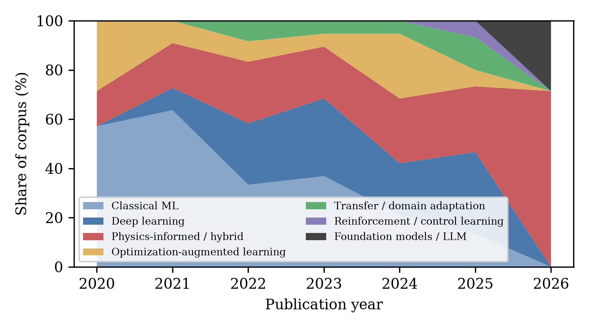
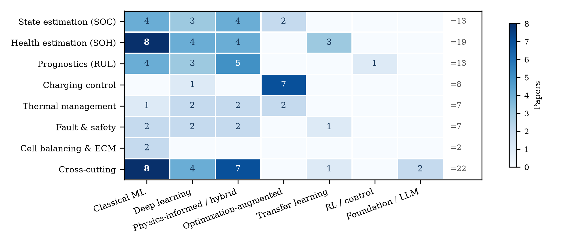
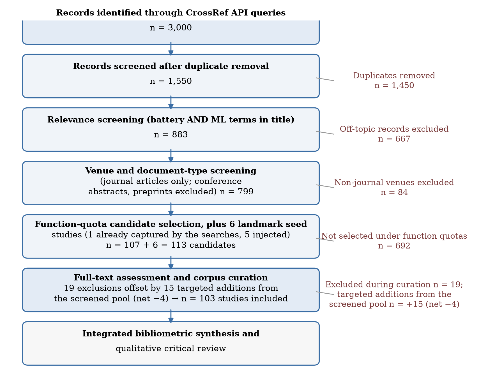
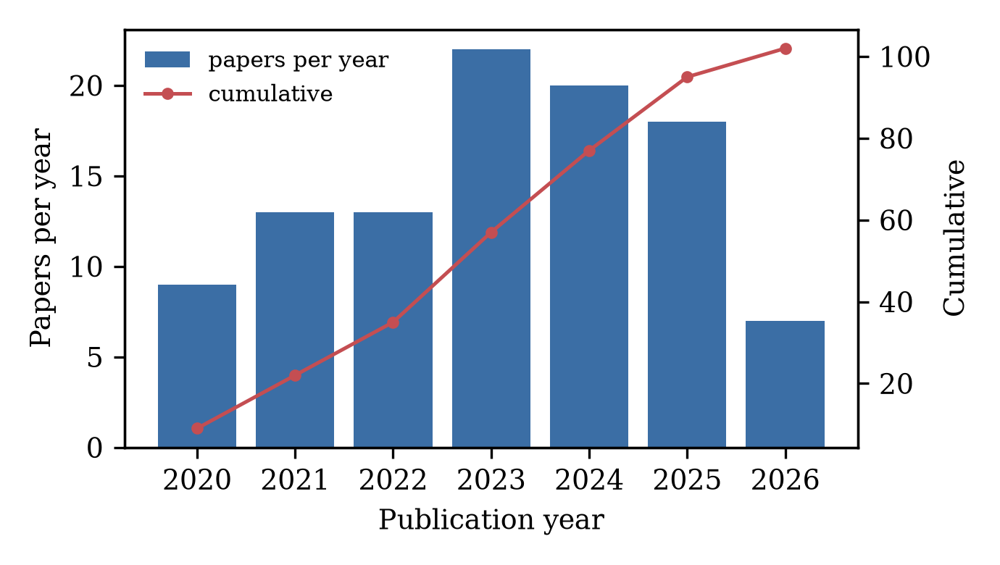
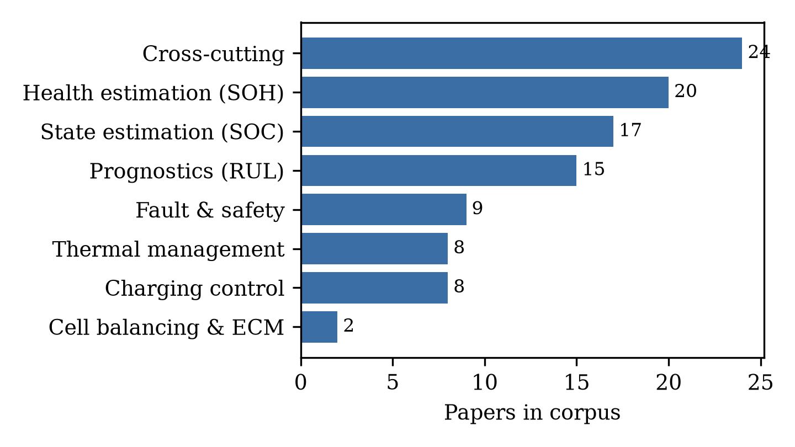
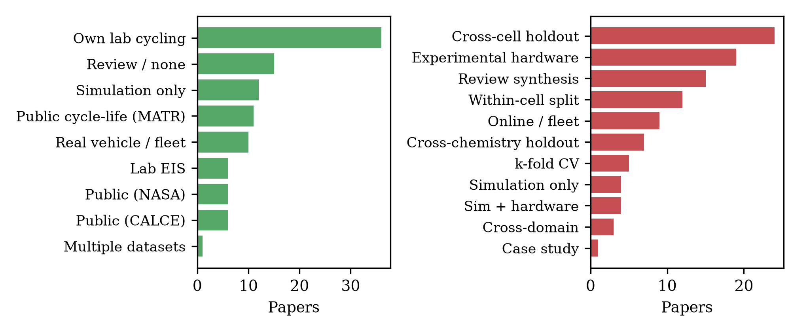
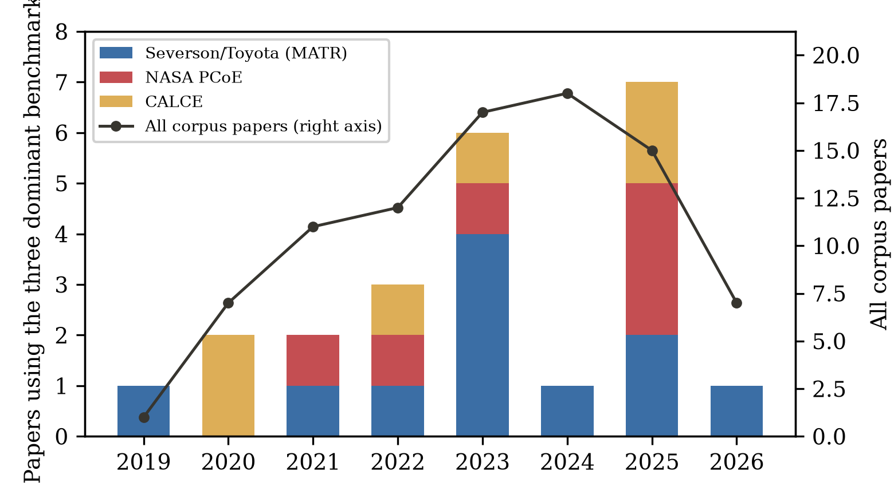
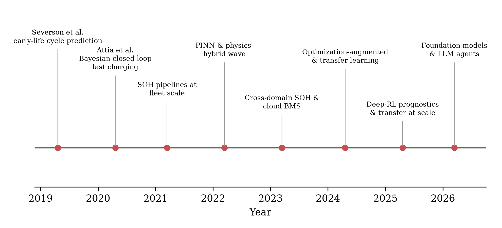

# Machine learning in battery management systems: a structured scoping review and classification of 103 peer-reviewed studies, 2019–2026

[](ML-BMS-Review.pdf)
[](ML-BMS-Corpus.xlsx)
[](#verification-methodology)

This repository is the complete, reproducible companion to the scoping review

> **Hussain Touhid Siddiquee, Syeda Salsabil Islam Ariya, Jasimul Islam Chowdhury, Tareq Shikdar**
> *Machine learning in battery management systems: a structured scoping review and classification of 103 peer-reviewed studies, 2019–2026.*
> Leading University, Sylhet, Bangladesh.

Every one of the **103 corpus papers** and the **14 conference sensitivity-set papers** cited in the manuscript was verified against the [Crossref registry](https://api.crossref.org) by direct DOI resolution, and every number, figure, and table in the paper can be regenerated from the released dataset with the released code.

---

## Contents

| Artifact | Description |
|---|---|
| [`ML-BMS-Review.pdf`](ML-BMS-Review.pdf) / [`.docx`](ML-BMS-Review.docx) | The manuscript (32 pp., 10 sections, 8 figures, 11 tables, 117 Crossref-verified references) |
| [`ML-BMS-Corpus.xlsx`](ML-BMS-Corpus.xlsx) | Human-readable workbook: **Papers** (103, clickable DOI links), **Summary** (corpus counts), **Conference sensitivity** (14, clickable DOI links) |
| [`corpus/papers.csv`](corpus/papers.csv) | The 103-paper classified corpus (machine-readable; one row per study, 16 fields) |
| [`corpus/conference_sensitivity.csv`](corpus/conference_sensitivity.csv) | The 14-paper conference sensitivity set used in Section 3.5 |
| [`corpus/`](corpus) | Full pipeline: search, screening, verification, statistics, figures, document build |
| [`figures/`](figures) | All manuscript figures as 300-dpi PNGs |

## The corpus in one figure



*Share of method families per publication year (Fig. 4 of the paper). Classical ML gives way to deep learning, then to physics-informed/hybrid approaches — with the first LLM-based studies appearing in 2025–2026.*

## Headline findings

- **Five-year method evolution.** Classical feature-based learners (11 of 23 papers through 2021) gave way to deep sequence models (2022–23), then to physics-informed/hybrid learning (24 papers; the modal family by 2024–26) and optimization-augmented learning.
- **Estimation succeeded; control lags.** SOH/RUL estimation dominates the literature (35 papers), but the control functions (charging, thermal, balancing) remain demonstrably transformable and under-evidenced for deployment.
- **The validation gap, quantified.** Only 9 of 103 studies demonstrate a system online or on fleet data; 17 use within-cell or unsupervised k-fold splits that leak trajectory information; 23 papers rest on a single public benchmark (MATR/NASA/CALCE).
- **The physics-informed validation paradox.** Physics-informed/hybrid papers are strong-protocol-validated *less* often than purely data-driven peers (54% vs 73%). Physics priors reduce data demand but do not substitute for rigorous out-of-distribution testing.
- **Conference-path sensitivity.** A 14-paper curated set from ACC/ECC/CCDC/APEC/VPPC/ITEC shows no better abstract-level validation transparency than journals (14% vs 21% hardware-stated) — the journal-only corpus is representative.
- **Foundation-model guardrails.** LLMs are positioned as orchestration layers, never estimators: Table 9 maps grounding, hallucination, uncertainty, latency, and safety-authority requirements, including that LLM components must never hold direct cell-level protection authority.
- **A reporting checklist.** Section 9.7 proposes **BMS-ML-RC**, a 12-item CONSORT/PRISMA-style reporting checklist (Table 11) for future machine-learning BMS studies.

## Figures

| Figure | Content |
|---|---|
|  | **Fig. 1** — Corpus map: management function × method family (91 primary-application papers) |
|  | **Fig. 2** — Study-selection flowchart (3,000 → 1,550 → 883 → 799 → 113 candidates → 103 included) |
|  | **Fig. 3** — Publications per year and cumulative total |
|  | **Fig. 4** — Method-family shares by year |
|  | **Fig. 5** — Application-area distribution |
|  | **Fig. 6** — Data sources and validation practices |
|  | **Fig. 7** — Benchmark saturation: reuse of MATR/NASA/CALCE vs total output |
|  | **Fig. 8** — Milestones 2019–2026 |

## Verification methodology

1. **Retrieval.** 30 bibliographic query strings × 4 date/sort passes against the Crossref REST API on **4–5 September 2026** → 3,000 records.
2. **Deduplication.** DOI-based → 1,550 unique records (1,450 duplicates removed).
3. **Relevance screening.** Title must contain battery-related **and** ML-related terms → 883 (−667).
4. **Venue/document-type screening.** Journal articles only; conference abstracts, preprints, non-scholarly venues excluded → 799 (−84).
5. **Function-quota selection + landmark seeds.** 107 candidates (balanced across 8 BMS functions and years) + 6 landmark seeds (1 already captured, 5 injected) = 113.
6. **Full-text curation.** 19 exclusions offset by 15 targeted additions → **103 included**.
7. **Verification.** Every DOI resolved directly against `api.crossref.org`; registry metadata compared to the record; per-paper citation counts (is-referenced-by-count, retrieved 5 September 2026) shipped in the dataset.

Full details: manuscript Section 2; screening funnel in `figures/fig2_prisma.png`.

## Reproducibility

### Requirements

- Python ≥ 3.10 with `openpyxl`, `matplotlib`, `python-docx`, `pandas`
- `curl` (network access to `api.crossref.org` and `api.semanticscholar.org`)
- LibreOffice (only for DOCX → PDF rendering)

### Pipeline

All commands run from the repository root. Every stage is cached/skipped-safe; outputs land in `corpus/` and `figures/`.

```bash
# 1. Search: 30 queries x 4 passes from Crossref (~3,000 records -> corpus/raw/*.json)
bash corpus/fetch_crossref.sh

# 2. Pool + dedupe + relevance gate + venue gate (-> corpus/pool.csv)
python3 corpus/pool.py

# 3. Screening: function quotas, landmark seeds, reclassification, curation
python3 corpus/screen.py
python3 corpus/fix_areas.py
python3 corpus/final_selection.py

# 4. Verification: resolve every DOI against Crossref, pull registry metadata
python3 corpus/verify_seeds.py
python3 corpus/verify_final.py

# 5. Statistics + consistency (every in-text number regenerates from here)
python3 corpus/build_stats.py
python3 corpus/consistency_check.py

# 6. Figures (Figs. 1-8 as PNG, 300 dpi)
python3 corpus/make_fig1_heatmap.py   # Fig. 1 heatmap
python3 corpus/make_fig1.py           # Fig. 2 PRISMA funnel
python3 corpus/make_figs.py           # Figs. 3-6 + Fig. 8 timeline
python3 corpus/make_fig7_saturation.py# Fig. 7 benchmark saturation

# 7. Manuscript (citations [[doi]] -> numbered [n], tables, references)
python3 build_docx.py                 # -> ML-BMS-Review.docx
soffice --headless --convert-to pdf ML-BMS-Review.docx   # -> ML-BMS-Review.pdf

# 8. Spreadsheet companion (Papers / Summary / Conference sensitivity)
python3 corpus/make_xlsx.py           # -> ML-BMS-Corpus.xlsx

# 9. Reference audit: re-resolve every reference DOI and compare titles
python3 corpus/final_audit.py
```

`corpus/raw/` ships the 150 cached Crossref responses from the original run, so stages 1–2 can be replayed offline; the released `corpus/papers_final.json`, `corpus/verified.json`, and `corpus/stats.json` pin the exact state behind the published figures.

### Single source of truth

`corpus/consistency_check.py` recomputes the paper's key statistics (function totals, review reconciliation, fleet/online overlap, validation breakdowns, method-family year counts) from `papers_final.json`. If any future edit changes the corpus, re-run it before touching the text.

## Repository structure

```
.
├── ML-BMS-Review.docx / .pdf      # manuscript
├── ML-BMS-Corpus.xlsx             # Papers + Summary + Conference sensitivity
├── figures/                       # Figs. 1-8 (300 dpi PNG)
├── paper_part1.py / _2 / _3       # manuscript text as structured blocks ([[doi]] citations)
├── build_docx.py                  # DOCX builder: citation resolution, tables, references
├── corpus/
│   ├── fetch_crossref.sh, queries.txt, raw/     # search stage (cached responses)
│   ├── pool.py, screen.py, fix_areas.py, final_selection.py   # screening
│   ├── verify_seeds.py, verify_final.py, final_audit.py       # Crossref verification + audit
│   ├── papers.csv, papers_final.json, verified.json, stats.json
│   ├── conference_sensitivity.csv, conference_verified.json   # Section 3.5 sensitivity set
│   ├── make_figs.py, make_fig1.py, make_fig1_heatmap.py, make_fig7_saturation.py
│   ├── make_xlsx.py, consistency_check.py, build_stats.py
│   └── ...
└── README.md
```

## Dataset schema (papers.csv)

| Field | Meaning |
|---|---|
| `doi` / `title` / `authors` / `journal` / `year` / `volume` / `issue` / `pages` | Crossref-verified bibliographic metadata |
| `area` | Management function (8 values, incl. cross-cutting) |
| `method` | Dominant method family (13 values) |
| `chem` | Electrochemistry (NMC, LFP, LCO, Li-metal, Li-S, mixed, various) |
| `data` | Primary data source (own lab, public benchmark, EIS lab, fleet, simulation, …) |
| `valid` | Validation approach (cross-cell holdout, within-cell split, hardware, online/fleet, …) |
| `finding` / `limit` | Coded headline finding and principal limitation |
| `cites` | Crossref is-referenced-by-count at retrieval (5 September 2026) |

## Citation

If this corpus or checklist is useful, please cite the manuscript:

```bibtex
@article{siddiquee2026mlbms,
  title  = {Machine learning in battery management systems: a structured scoping review
            and classification of 103 peer-reviewed studies, 2019--2026},
  author = {Siddiquee, Hussain Touhid and Ariya, Syeda Salsabil Islam and
            Chowdhury, Jasimul Islam and Shikdar, Tareq},
  year   = {2026},
  note   = {Manuscript and verified corpus; this repository}
}
```

## Provenance and AI disclosure

The bibliographic corpus is machine-curated and human-verified: classification fields were coded by the lead author from Crossref-verified metadata and reviewed by the co-author team (corrective pass; no formal inter-rater statistic is claimed — see manuscript §2.5). Writing-support and language-enhancement tools (ChatGPT, Grammarly, QuillBot) were used for grammar, readability, and restructuring; all technical content, analysis, interpretations, and research contributions are the authors' own (see the Acknowledgment section of the manuscript).
